# falken

`falken` is an offline-first iOS chat app for iPhone and iPad. It provides a focused ChatGPT-style interface backed by local GGUF models through a Swift Package wrapper around `llama.cpp`.

The default path is local inference. Optional remote providers can be added behind the responder abstraction without replacing the on-device chat architecture.

## Quick Start

1. Install Xcode with iOS SDK support.
2. Add the required local model file:

   ```text
   falken/Models/google_gemma-3-1b-it-Q4_K_M.gguf
   ```

3. Open `falken.xcodeproj`.
4. Select the shared `falken` scheme.
5. Select a connected iPhone or iPad.
6. Set signing to your Apple development team.
7. Build and run.

The app is designed to run on physical devices. Simulator builds are useful for compile checks and UI iteration, but local model performance and memory behavior must be validated on the target device.

## Requirements

- Xcode with iOS SDK support.
- iOS 17 or newer for the local backend package.
- A physical iPhone or iPad for local inference testing.
- Apple development signing configured for installing the app on your device.
- A quantized GGUF model installed locally before using offline inference.

## Model Files

Model weights are intentionally ignored by Git because they are large binary artifacts. Keep downloads, conversion caches, and temporary model files out of the repository.

Required small/fast profile:

```text
falken/Models/google_gemma-3-1b-it-Q4_K_M.gguf
```

Optional higher-quality profile:

```text
falken/Models/google_gemma-3-4b-it-Q4_K_M.gguf
```

The build phase `Validate Local Model Resources` checks that model resources are sane before bundling. It expects exactly one bundled GGUF model for the current default app target and rejects cache metadata such as `.lock` and `.metadata` files.

If you add a new model family or rename a model file, update:

- `falken/Services/LocalModelRegistry.swift`
- `falken/Models/LocalModelProfile.swift`
- the model validation script in `falken.xcodeproj`
- any user-facing installation copy in the Models screen

## App Behavior

### Cold Launch

When the app is relaunched after being quit, it shows the welcome screen instead of reopening the previous active chat. Any persisted active conversation is migrated into Recent Chats during history restore, then the visible chat starts empty.

This keeps launch lightweight and avoids surprising users by reopening an old conversation. Users can resume prior conversations from the sidebar or drawer.

### Recent Chats

Chats are archived into Recent Chats when the user starts a new chat, loads another chat, renames a chat, or when a persisted active conversation is restored after relaunch. Recent chats are pruned by `ChatHistoryPolicy` so storage and memory remain bounded.

Pinned chats are preserved ahead of unpinned chats and are not removed by stale-chat cleanup.

### Local Model Loading

The model loads only when local inference is needed. Changing model settings unloads the current model; the next generation reloads it with the new settings.

The app unloads the model for memory warnings, background transitions, termination, thermal pressure, and repeated generation timeouts.

### Settings and Diagnostics

The Settings screen exposes:

- provider selection
- appearance selection
- model presets
- advanced local model controls
- settings impact preview
- local telemetry and diagnostics
- chat history clearing

Diagnostics are local-only and designed for troubleshooting. They should not include chat message text or user identifiers.

## Screenshots and UX Walkthrough

The screenshots below show the current app experience and the main operational surfaces users rely on while running local inference.

### Welcome and Composer

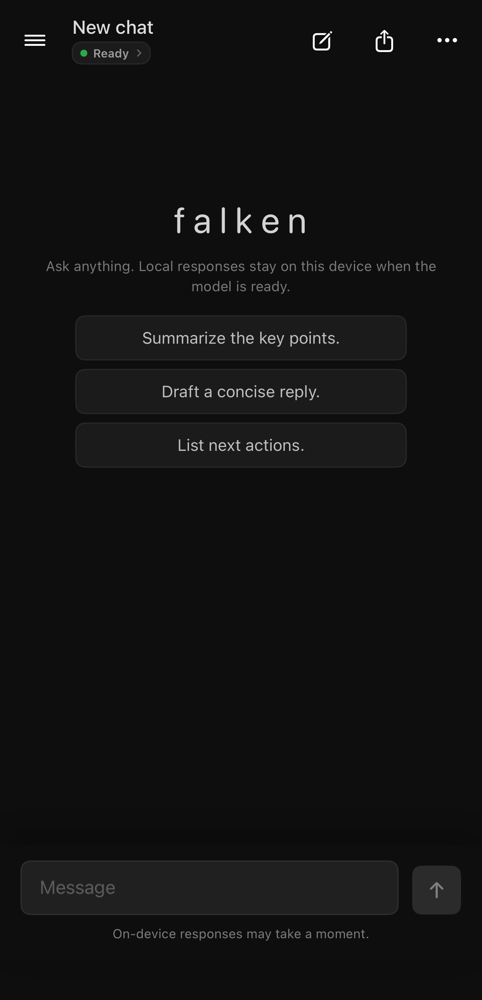

On cold launch, `falken` opens to a fresh chat with the welcome screen visible. The header shows the current chat title, a compact model status chip, new-chat/share/overflow actions, and the bottom composer. The suggested prompts help users start without needing to understand model settings first.

Technically, this state is produced by `ChatViewModel.restoreHistory()`: any previously active persisted conversation is moved into `recentChats`, while `messages` is reset to an empty array. `EmptyChatView` renders the brand, local-first reassurance copy, and starter prompt actions. The status chip is derived from `ProviderStatus`, which reflects `LocalAIManager.LoadState` for local inference.

### Recent Chats Drawer

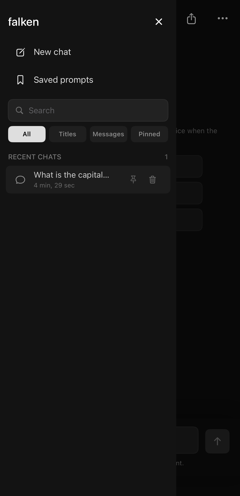

The drawer gives users a simple way to resume prior work. It includes a new-chat action, saved prompts, scoped search, and recent chat rows with pin/delete controls. This makes cold launch less disruptive: old work is available, but it does not automatically take over the main screen.

Technically, `SideMenuView` receives `recentChats` from `ChatViewModel`. Search is local and in-memory, with scopes for all chats, titles, message bodies, and pinned chats. Pinning mutates `ChatSession.isPinned`; sorting keeps pinned conversations above unpinned conversations, then orders by `updatedAt`.

### Overflow Menu

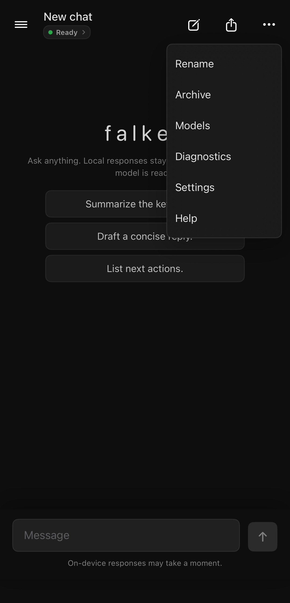

The overflow menu is the main command surface for chat-level and app-level actions. Users can rename or archive the current conversation, inspect installed models, open diagnostics, adjust settings, or read help.

Technically, menu selection flows through `ChatViewModel+Navigation.swift`. Each item maps to an `OverflowMenuItem`, which drives a full-screen modal. This keeps modal routing centralized while allowing each content area to live in focused SwiftUI views such as `OverflowModalSettingsContent`, `OverflowModalDiagnosticsContent`, and `OverflowModalModelManagementContent`.

### Diagnostics Status

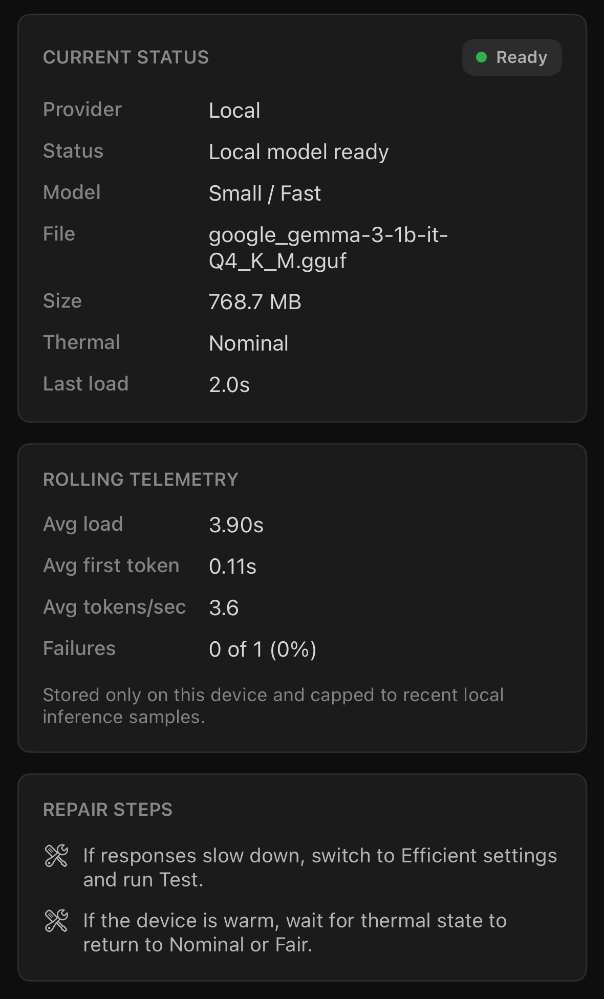

The diagnostics status view answers the practical question, "Is the local model healthy right now?" It shows provider, model, file, size, thermal state, last load time, rolling performance telemetry, and suggested repair steps.

Technically, this combines `LocalModelDiagnostics`, `LocalModelRuntimeTelemetry`, `ProviderStatus`, and `LocalModelSettingsValidation`. Load time, first-token latency, tokens per second, and failure counts are stored locally through `LocalInferenceTelemetryStore`. The rolling samples are capped so diagnostics remain small and device-local.

### Diagnostics Report

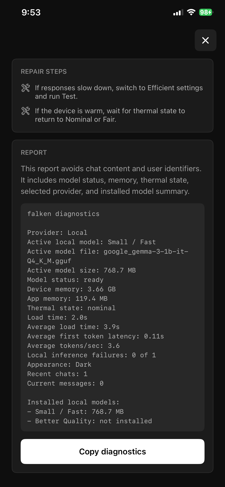

The diagnostics report is designed for support and debugging. It explains that chat content and user identifiers are excluded, then presents a copyable technical report containing model status, device memory, app memory, thermal state, load timing, telemetry, appearance, recent chat count, current message count, and installed model summary.

Technically, `ChatViewModel.diagnosticsReport()` formats this report from app state and local model diagnostics. The report intentionally avoids prompt text and response text. `Copy diagnostics` writes the generated string to `UIPasteboard` so users can share reproducible technical context without exposing conversations.

### Settings Overview

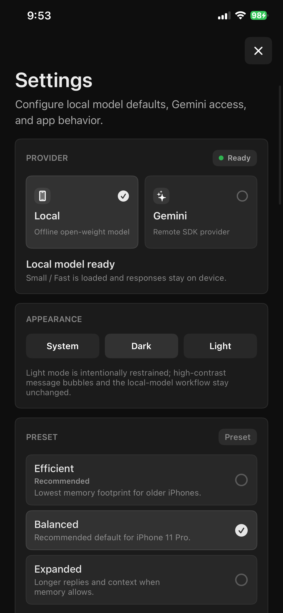

Settings start with high-level choices: local versus remote provider, appearance, and memory-oriented local model presets. The Local provider is selected and marked ready, while Gemini is shown as a remote-provider slot behind the same responder architecture.

Technically, provider selection is persisted with `ChatProviderStore`, appearance with `AppAppearanceStore`, and local model defaults with `LocalModelSettingsStore`. The preset rows map to `LocalModelPreset` values that tune context length, output limit, GPU layers, thread count, and sampling defaults. Selecting settings unloads the current model so the next load uses the new `LlamaInferenceOptions`.

### Settings Preview and Model Diagnostics

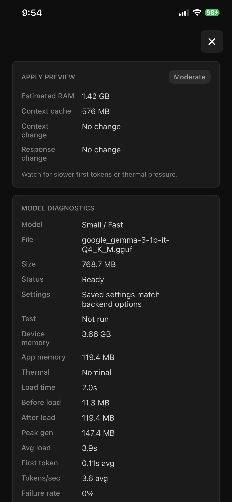

The apply preview estimates the cost of the draft settings before the user applies them. It shows estimated RAM, context cache size, context change, response change, and risk level. The model diagnostics table below shows exactly what the backend sees: active model, file, size, settings validation, device memory, app memory, thermal state, load timings, peak generation memory, and failure rate.

Technically, `LocalModelSettingsImpact` estimates memory/context impact from the draft settings and active model profile. `LocalAIManager.validateAppliedSettings` compares saved settings against the actual backend options that would be sent to `llama.cpp`, catching mismatches before users assume a setting is active.

### Sampling and Performance Controls

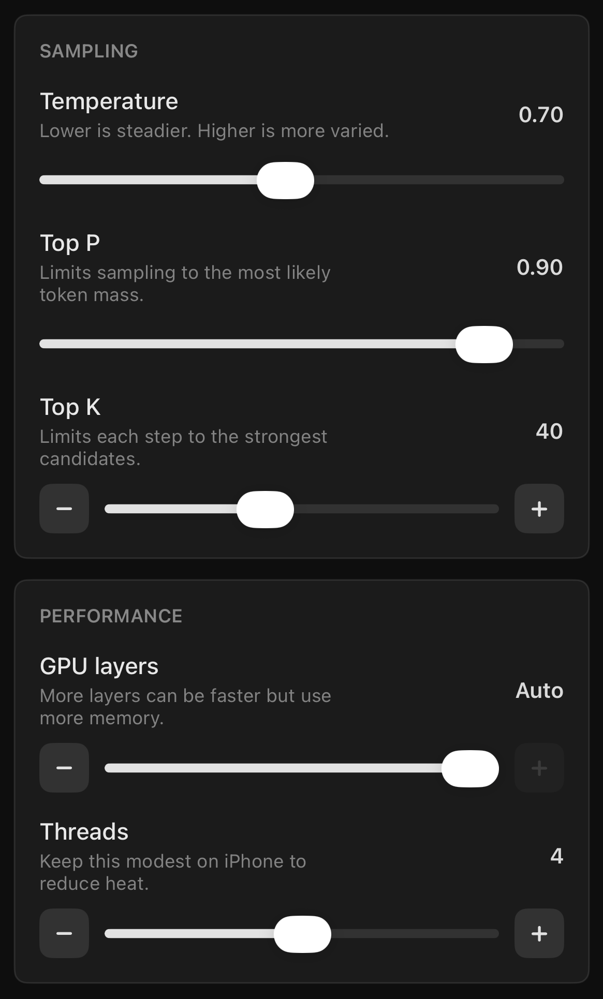

Advanced controls expose the tradeoffs that affect local generation quality and device pressure. Temperature, Top P, and Top K change sampling behavior. GPU layers and thread count influence latency, memory pressure, battery drain, and heat.

Technically, these controls feed `LocalModelSettings`, then `LocalAIManager.makeInferenceOptions(from:)` converts them into `LlamaInferenceOptions`. GPU layers use `99` as the app-level "Auto" sentinel, which lets the backend choose acceleration strategy while keeping the UI simple.

### Generation and Reproducibility Controls

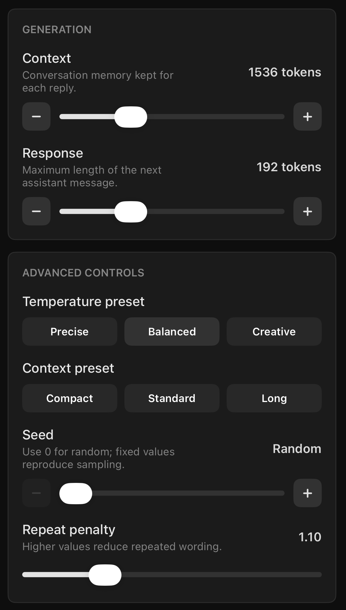

Generation controls tune how much conversation the model can see, how long the next answer can be, how deterministic sampling should be, and how aggressively repeated wording is discouraged. Presets make common choices fast, while sliders allow precise manual tuning.

Technically, context and response values reserve token budget before `PromptContextOptimizer` compacts history. Seed `0` means random; non-zero seeds are persisted as fixed `UInt32` values for reproducible sampling. Repeat penalty maps directly into backend inference options to reduce local loops and phrase repetition.

### Installed Models

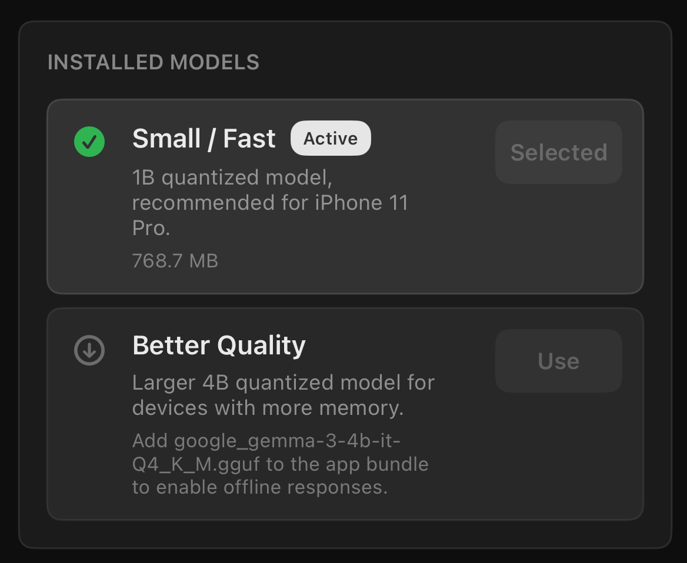

The Models screen shows which local profiles are actually installed. Small / Fast is active and selected. Better Quality is visible but unavailable because its GGUF file has not been bundled.

Technically, `LocalModelResourceValidator.installedModels()` checks bundle lookup, expected filename, target membership, and file size bounds from `LocalModelRegistry`. Only valid installed profiles can be selected. This prevents the UI from switching to a profile that cannot load.

### Model Installation Details

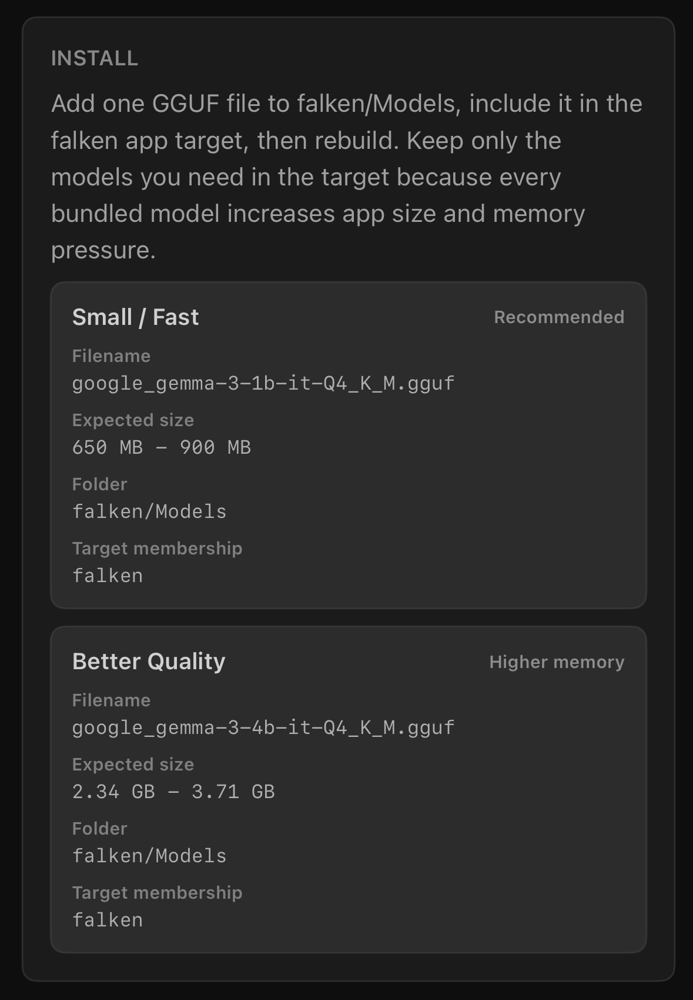

The installation panel gives users the exact filenames, expected size ranges, folder, and target membership required for each supported profile. It also explains why users should keep only the models they need in the app target: every bundled model increases app size and can increase memory pressure.

Technically, these details are generated from the same registry data used by validation. This reduces documentation drift inside the app: if a model descriptor changes, install instructions, validation, and model status should change together.

### Model Diagnostics and Validation Actions

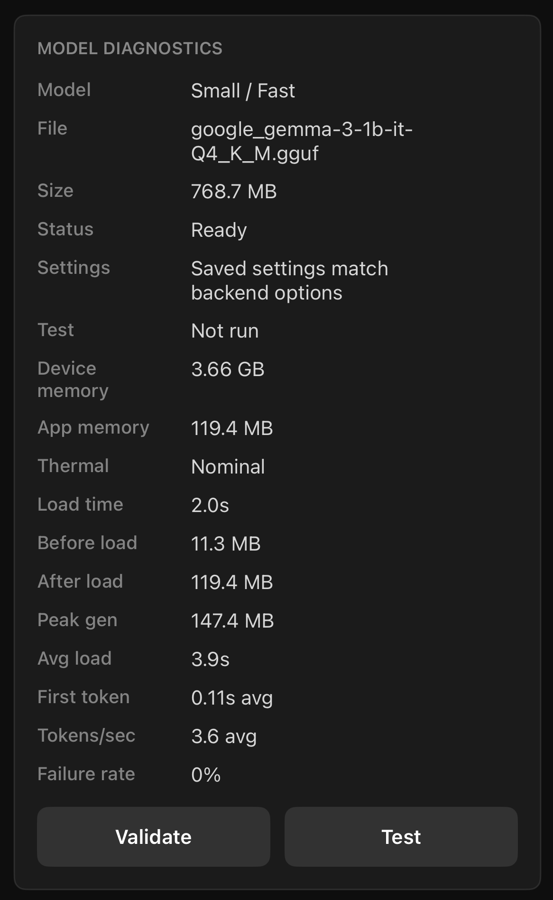

The model diagnostics panel exposes direct validation and test actions. `Validate` checks whether saved settings match backend options. `Test` runs a tiny local prompt to confirm that the loaded model can generate a response.

Technically, validation does not require a full user conversation; it compares settings transformation and backend option construction. Testing uses `LocalAIManager.testCurrentSettings()` with a short prompt and records the result in `LocalModelSettingsTestResult`. This separates configuration correctness from runtime generation health.

## Architecture

The codebase uses SwiftUI with an MVVM-oriented app shell and smaller services for model lifecycle, generation, persistence, and validation.

- `falken/Views`: SwiftUI screens and reusable UI components.
- `falken/ViewModels`: presentation state, chat state, and user actions.
- `falken/Models`: value types for chat state, runtime state, settings, diagnostics, presets, profiles, and history policy.
- `falken/Services`: local model lifecycle, responders, persistence, telemetry, memory policy, cleanup, and validation.
- `Packages/LlamaBackend`: local Swift Package exposing `LlamaBackendKit`, a Swift API over the `llama.cpp` XCFramework binary target.

Important runtime components:

- `LocalAIManager`: owns local model load/unload, settings, diagnostics, telemetry, generation, memory handling, and cancellation.
- `LlamaLocalEngine`: wraps the native backend, applies the model chat template, streams tokens, and truncates prompt history by token budget.
- `ChatViewModel`: owns app-facing chat state, recent chats, sharing, archiving, renaming, search, and presentation.
- `ChatGenerationCoordinator`: smooths streamed tokens into UI-friendly generation events.
- `ChatPersistenceService`: schedules and bounds local chat history saves.
- `ChatHistoryPolicy`: prunes visible, archived, and persisted chat history.
- `PromptContextOptimizer`: trims older context and adds a compact summary before sending history to the model.
- `LocalModelRegistry`: defines supported local model profiles and their expected resources.
- `LocalModelResourceValidator`: validates bundled model resources and powers the Models screen installation status.
- `LocalModelMemoryPolicy`: blocks or unloads local inference when memory, model size, or thermal state make it unsafe.
- `BackgroundCleanupService`: removes stale unpinned chats and old telemetry.

For contributor workflow, warning gates, and implementation rules, see `docs/DEVELOPMENT.md`.

## Build and Verify

Generic iOS build:

```sh
xcodebuild -quiet \
  -project falken.xcodeproj \
  -scheme falken \
  -destination generic/platform=iOS \
  build
```

Simulator compile check:

```sh
xcodebuild -quiet \
  -project falken.xcodeproj \
  -scheme falken \
  -destination platform=iOS\ Simulator,name=iPhone\ 17 \
  build
```

The project should build cleanly with `-quiet`; unexpected output usually means a warning or build-system issue was introduced.

## Troubleshooting

### The model is unavailable in the app

Check that the GGUF file:

- exists in `falken/Models`
- has the exact expected filename
- is included in the `falken` target membership
- is copied into the app bundle during build
- is within the expected size range in `LocalModelRegistry`

### Build fails in model validation

Remove extra model artifacts from `falken/Models`. The app should not bundle Hugging Face cache folders, lock files, metadata files, or multiple GGUF files unless the validation script and registry have been intentionally updated.

### The app reloads a model after settings change

This is expected. Saved settings are applied on the next model load. The app unloads the current model when settings or model profile changes.

### A previous chat appears in Recent Chats after relaunch

This is expected. On cold launch, the previously active conversation is archived into Recent Chats and the welcome screen is shown.

### Local inference is slow or stops

Use Efficient settings, reduce context/output limits, close other apps, and test on a cool device. Older devices and larger models are more likely to hit memory or thermal guardrails.

## Repository Hygiene

The repository excludes generated build output, user-specific Xcode state, editor state, secrets, and large local model artifacts. Keep model downloads and conversion caches outside Git.

Before pushing, run both build commands above. For changes that affect persistence, model loading, or generation, also validate on a physical device.
